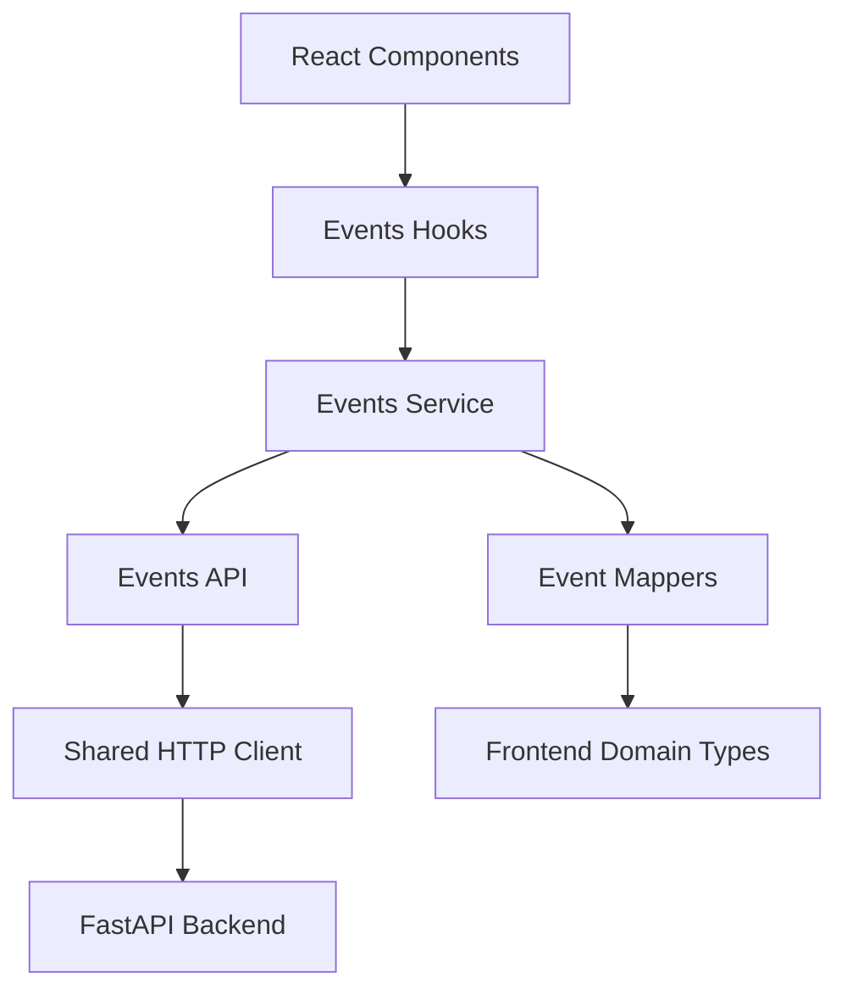
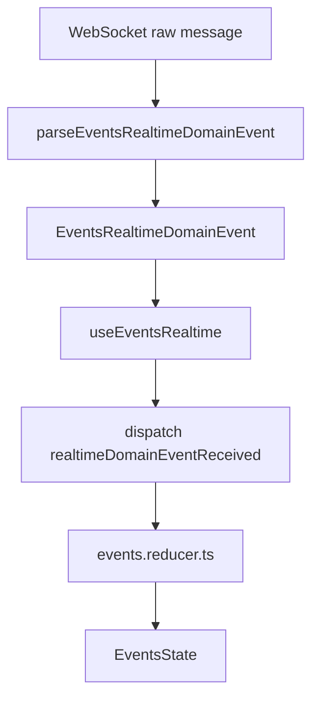

# Realtime Events Management App — Frontend

React frontend for a realtime events management application. The app allows users to browse events, create and update
events, manage attendance, cancel or restore events, and receive live updates through WebSocket notifications.

This project was built as the frontend part of a full-stack technical exercise. The backend is a FastAPI service that
exposes REST endpoints for events, locations, and joiners, plus a WebSocket endpoint for realtime updates.

## Live Demo

Frontend:

```bash
https://tt-events-realtime-frontend-react.vercel.app/
```

Backend:

```bash
https://tt-events-realtime-service-python.onrender.com
```

> Note: the backend is deployed on a free Render instance, so the first request after inactivity may take a few seconds
> while the service wakes up.

## Main Features

* List visible events.
* Create events with a known date or with a date to be defined.
* Edit event information.
* Edit event location information.
* Cancel and restore events.
* Join and leave events as the current user.
* Show active joiners per event.
* Load joiners in batch to avoid unnecessary N+1 requests.
* Receive realtime updates through WebSocket.
* Reconnect automatically when the WebSocket connection is lost.
* Support English and Spanish UI translations.
* Responsive interface built with Tailwind CSS.

## Tech Stack

* React
* TypeScript
* Vite
* Tailwind CSS
* i18next
* Lucide React
* Vitest
* React Testing Library

## Project Structure

```bash
src/
├── app/
│   └── App.tsx
├── domains/
│   └── events/
│       ├── api/
│       │   ├── events-api.ts
│       │   └── events-api.types.ts
│       ├── components/
│       ├── hooks/
│       ├── mappers/
│       │   └── event.mapper.ts
│       ├── realtime/
│       │   ├── events-realtime-client.ts
│       │   └── events-realtime-domain-event.ts
│       ├── services/
│       │   └── events.service.ts
│       ├── state/
│       │   ├── events.actions.ts
│       │   ├── events.reducer.ts
│       │   └── events.state.ts
│       ├── types/
│       └── utils/
├── shared/
│   └── http/
│       └── http-client.ts
└── main.tsx
```

## Architecture Overview

The frontend follows a domain-oriented structure. The `events` domain owns its API layer, service layer, mappers,
realtime client, state reducer, hooks, components, and types.

The goal is to keep the UI away from transport details such as `fetch`, API DTOs, and raw WebSocket messages.



### Layers

| Layer           | Responsibility                                                                               |
|-----------------|----------------------------------------------------------------------------------------------|
| Components      | Render UI and receive user interaction                                                       |
| Hooks           | Coordinate screen behavior and user actions                                                  |
| State           | Keep explicit state transitions through reducer actions                                      |
| Service         | Expose frontend-friendly event operations                                                    |
| API             | Call backend endpoints and return API DTOs                                                   |
| Mappers         | Convert API DTOs into frontend domain models                                                 |
| HTTP Client     | Handle generic HTTP concerns such as base URL, JSON parsing, query params, and error parsing |
| Realtime Client | Manage WebSocket lifecycle and emit domain realtime events                                   |

## State Management

The application uses React `useReducer` instead of Redux. This keeps the state management simple while making state
transitions explicit and testable.

Main state files:

```bash
src/domains/events/state/events.state.ts
src/domains/events/state/events.actions.ts
src/domains/events/state/events.reducer.ts
```

The reducer handles transitions such as:

```ts
dispatch({type: 'eventsLoaded', payload: {events, preferredId}})
dispatch({type: 'joinersBatchLoaded', payload: {joinersByEvent}})
dispatch({type: 'eventJoinerAdded', payload: {eventId, joiner}})
dispatch({type: 'eventJoinerRemoved', payload: {eventId, userId}})
dispatch({type: 'realtimeDomainEventReceived', payload: {event}})
dispatch({type: 'operationFailed', payload: {error}})
dispatch({type: 'liveChanged', payload: {live}})
```

This avoids spreading unrelated `setState` calls across the screen and makes the application easier to reason about.

## Realtime Architecture

The WebSocket flow is intentionally separated from React state. The WebSocket client does not update React state
directly. Instead, it parses raw messages into domain realtime events, then the hook dispatches reducer actions.



Supported domain realtime events include:

```ts
type EventsRealtimeDomainEvent =
  | { type: 'event.created'; eventId: number }
  | { type: 'event.updated'; eventId: number; patch: EventRealtimePatch }
  | { type: 'event.canceled'; eventId: number; patch: EventRealtimePatch }
  | { type: 'event.uncanceled'; eventId: number; patch: EventRealtimePatch }
  | {
  type: 'joiner.joined'
  eventId: number
  joiner: EventJoiner | null
  joinersCount: number | null
}
  | {
  type: 'joiner.left'
  eventId: number
  joiner: EventJoiner | null
  joinersCount: number | null
}
  | {
  type: 'location.updated'
  locationId: number
  location: LocationRealtimePatch
}
```

For `event.created`, the frontend refreshes the events list instead of creating a partial event locally. This is
intentional because the backend event creation notification may not contain the full `EventDetails` object required by
the UI, such as the complete location and joiner count.

## API Integration

The frontend communicates with these backend areas:

### Events

```http
GET    /events
GET    /events/{event_id}
POST   /events
PATCH  /events/{event_id}
POST   /events/{event_id}/cancel
POST   /events/{event_id}/uncancel
```

### Locations

```http
GET    /locations
PATCH  /locations/{location_id}
```

### Joiners

```http
POST   /joiners
GET    /joiners?event_ids=1&event_ids=2
GET    /events/{event_id}/joiners
DELETE /joiners/{event_id}
```

The batch joiners endpoint is used to avoid loading joiners event by event when multiple events are visible.

## API DTO Mapping

The frontend does not expose backend DTOs directly to components. API responses are converted through mappers:

```bash
src/domains/events/mappers/event.mapper.ts
```

Example:

```ts
API
response => EventDetailsResponse => mapEventDetailsResponse => EventDetails
```

This keeps the UI stable even if the backend response shape changes later.

## Environment Variables

Create a `.env.local` file for local development when needed:

```bash
VITE_API_BASE_URL=/api
VITE_WS_BASE_URL=ws://localhost:8000/ws/events
```

For production, use absolute URLs:

```bash
VITE_API_BASE_URL=https://your-backend.example.com
VITE_WS_BASE_URL=wss://your-backend.example.com/ws/events
```

### Local Proxy

During local development, the app can use Vite's proxy:

```bash
VITE_API_BASE_URL=/api
```

This lets the browser call:

```bash
http://localhost:3000/api/events
```

while Vite forwards the request to the backend service.

## Getting Started

### 1. Install dependencies

```bash
npm install
```

### 2. Create local environment file

```bash
cp .env.example .env.local
```

Or create it manually:

```bash
VITE_API_BASE_URL=/api
VITE_WS_BASE_URL=ws://localhost:8000/ws/events
```

### 3. Run the app

```bash
npm run dev
```

The frontend should be available at:

```bash
http://localhost:3000
```

## Available Scripts

```bash
npm run dev
```

Starts the Vite development server.

```bash
npm run build
```

Builds the production bundle.

```bash
npm run preview
```

Serves the production build locally.

```bash
npm run lint
```

Runs linting checks.

```bash
npm test
```

Runs the test suite.

```bash
npm test -- --run
```

Runs the test suite once, useful for CI or final validation.

## Testing Strategy

The test strategy focuses on the parts that carry the most application logic:

* API client behavior.
* HTTP error handling.
* API DTO mappers.
* Events reducer transitions.
* Realtime message parsing.
* Main user interactions in the events screen.

Important areas covered:

```bash
src/shared/http/http-client.test.ts
src/domains/events/api/events-api.test.ts
src/domains/events/mappers/event.mapper.test.ts
src/domains/events/state/events.reducer.test.ts
src/domains/events/realtime/events-realtime-client.test.ts
src/domains/events/services/events.service.test.ts
src/domains/events/components/EventsScreen.test.tsx
```

## Design Decisions

### Why a reducer?

The events screen has several pieces of state that are related:

* Events list.
* Selected event.
* Joiners grouped by event.
* Loading status.
* Error state.
* WebSocket live status.

Using `useReducer` makes those transitions explicit and avoids scattered state updates.

### Why API mappers?

The backend and frontend have different responsibilities. The backend returns API DTOs. The frontend works with
UI/domain models. Mappers keep that boundary clear.

### Why a shared HTTP client?

Generic HTTP behavior should not live inside the events domain. The shared HTTP client handles base URL composition,
JSON parsing, query parameters, and error extraction in one place.

### Why a domain realtime event model?

Raw WebSocket messages are transport details. The rest of the app should not need to know the raw message shape. The
realtime client converts raw messages into meaningful events such as `joiner.joined`, `event.updated`, or
`location.updated`.

### Why refresh after `event.created`?

The creation message may not contain all the information required by the UI. Refreshing the list guarantees the frontend
receives the complete `EventDetails` object from the REST API.

## Known Limitations

* Authentication is simplified and based on a bearer token containing the user name.
* The backend may take some seconds to respond if the free Render instance is sleeping.
* `event.created` uses REST reconciliation instead of local state creation.
* If an event update changes `location_id` without sending the full location object, the frontend should refresh the
  event list to avoid stale location data.

## Deployment

The frontend can be deployed to Vercel.

Recommended production variables:

```bash
VITE_API_BASE_URL=https://tt-events-realtime-service-python.onrender.com
VITE_WS_BASE_URL=wss://tt-events-realtime-service-python.onrender.com/ws/events
```

Build command:

```bash
npm run build
```

Output directory:

```bash
dist
```

## Final Notes

The app favors clarity and explicit boundaries over adding external state management libraries. The current architecture
keeps the frontend small enough for a technical exercise while still showing separation of concerns, typed API
contracts, realtime handling, reducer-based state management, and testable domain logic.
