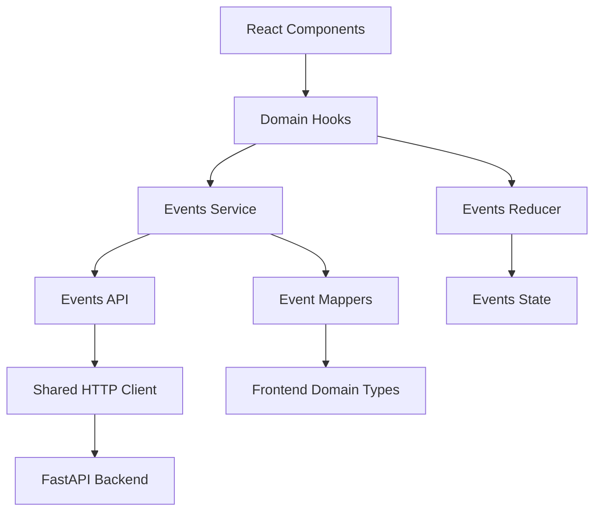
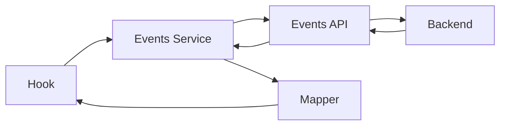
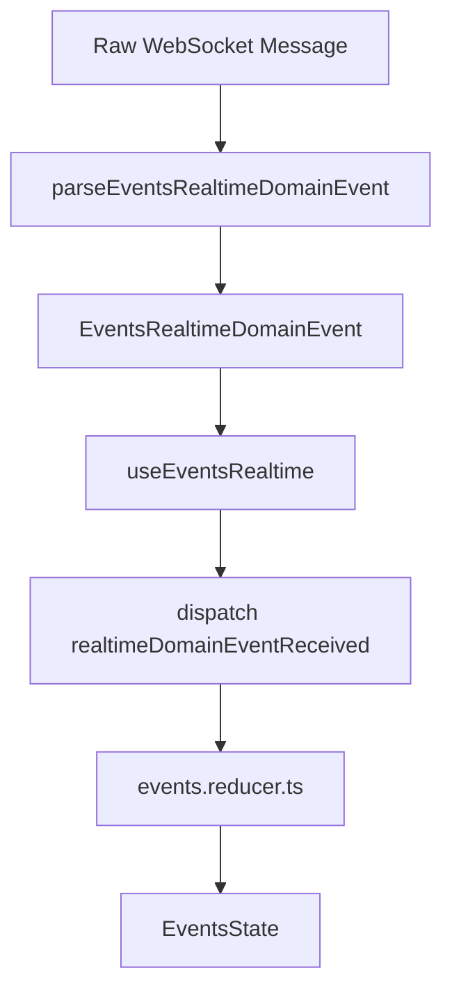

# Technical Documentation — Realtime Events Management App Frontend

## 1. Overview

This document describes the technical design of the Realtime Events Management App frontend. The application is a
React + TypeScript single-page application that allows users to manage events, locations, attendance, and realtime
updates.

The frontend communicates with a FastAPI backend through REST endpoints and a WebSocket connection. REST is used for
command/query operations, while WebSocket is used to keep the UI synchronized when events, locations, or joiners change.

The main goal of the frontend architecture is to keep the UI simple while separating transport concerns, API contracts,
domain mapping, realtime parsing, and state transitions.

---

## 2. Technology Stack

| Area                 | Technology                     |
|----------------------|--------------------------------|
| UI Framework         | React                          |
| Language             | TypeScript                     |
| Build Tool           | Vite                           |
| Styling              | Tailwind CSS                   |
| Icons                | Lucide React                   |
| Internationalization | i18next                        |
| Testing              | Vitest + React Testing Library |
| Realtime             | Native WebSocket API           |
| Deployment           | Vercel                         |

---

## 3. High-Level Architecture

The frontend is organized around the `events` domain. Instead of placing all logic inside components, the application
separates responsibilities into API clients, services, mappers, hooks, reducers, and UI components.



The main architectural layers are:

| Layer           | Responsibility                                         |
|-----------------|--------------------------------------------------------|
| Components      | Render UI and call event handlers                      |
| Hooks           | Coordinate screen behavior and user actions            |
| State           | Manage explicit state transitions through `useReducer` |
| Service         | Expose frontend-friendly event operations              |
| API             | Call backend endpoints and return API DTOs             |
| Mappers         | Convert backend DTOs into frontend domain models       |
| HTTP Client     | Handle generic HTTP behavior                           |
| Realtime Client | Manage WebSocket lifecycle and parse realtime messages |

---

## 4. Project Structure

```bash
src/
├── app/
│   └── App.tsx
├── domains/
│   └── events/
│       ├── api/
│       │   ├── events-api.ts
│       │   └── events-api.types.ts
│       ├── components/
│       ├── hooks/
│       ├── mappers/
│       │   └── event.mapper.ts
│       ├── realtime/
│       │   ├── events-realtime-client.ts
│       │   └── events-realtime-domain-event.ts
│       ├── services/
│       │   └── events.service.ts
│       ├── state/
│       │   ├── events.actions.ts
│       │   ├── events.reducer.ts
│       │   └── events.state.ts
│       ├── types/
│       └── utils/
├── shared/
│   └── http/
│       └── http-client.ts
└── main.tsx
```

---

## 5. Domain-Oriented Design

The `events` domain owns all logic related to events, locations, attendance, and realtime updates.

This keeps the application cohesive:

```bash
domains/events/
├── api/        # Raw backend calls and API DTOs
├── mappers/    # API DTO -> frontend domain model conversion
├── services/   # Frontend-friendly operations
├── realtime/   # WebSocket client and realtime domain events
├── state/      # Reducer, actions, and initial state
├── hooks/      # Screen orchestration
├── components/ # UI
├── types/      # Frontend domain types
└── utils/      # Pure helpers
```

The benefit is that components do not need to know how the backend is called, how DTOs are shaped, or how WebSocket
messages are parsed.

---

## 6. HTTP Layer

Generic HTTP behavior is centralized in:

```bash
src/shared/http/http-client.ts
```

The shared HTTP client is responsible for:

* Building request URLs.
* Applying query parameters.
* Sending JSON bodies.
* Parsing JSON responses.
* Handling empty responses.
* Extracting useful error messages.
* Throwing errors for failed requests.

This avoids duplicating `fetch` logic across domain services.

---

## 7. API Layer

The events API layer lives in:

```bash
src/domains/events/api/events-api.ts
src/domains/events/api/events-api.types.ts
```

This layer communicates directly with the backend and returns API response DTOs.

Example responsibilities:

```ts
eventsApi.getEvents()
eventsApi.getJoiners(eventId)
eventsApi.getJoinersForEvents(eventIds)
eventsApi.create(input, userName)
eventsApi.update(eventId, input, userName)
eventsApi.cancel(eventId, userName)
eventsApi.uncancel(eventId, userName)
eventsApi.updateLocation(locationId, input, userName)
```

This layer should not contain UI logic or domain state transitions.

---

## 8. Mapping Layer

The mapping layer lives in:

```bash
src/domains/events/mappers/event.mapper.ts
```

It converts backend responses into frontend domain models.

Example:

```text
EventDetailsResponse -> EventDetails
EventJoinerResponse -> EventJoiner
EventJoinerInfoResponse -> EventJoiner
CreatedEventResponse -> CreatedEvent
EventLocationResponse -> EventLocation
```

This is important because the API contract and the frontend model are not always identical.

For example, the batch joiners endpoint returns a lightweight shape:

```ts
{
  event_id: number
  user_id: number
  user_name: string
}
```

The frontend maps it into its internal `EventJoiner` model by assigning default values for fields that are not present
in the batch response:

```ts
{
  id: null
  event_id: number
  user_id: number
  user_name: string
  left_at: null
}
```

This keeps UI components consistent regardless of which backend endpoint provided the data.

---

## 9. Service Layer

The service layer lives in:

```bash
src/domains/events/services/events.service.ts
```

The service layer exposes operations that the rest of the frontend can use without knowing about API DTOs.

Example:

```ts
eventsService.getEvents()
eventsService.getJoinersForEvents(eventIds)
eventsService.join(eventId, userName)
eventsService.leave(eventId, userName)
eventsService.create(input, userName)
eventsService.update(eventId, input, userName)
eventsService.cancel(eventId, userName)
eventsService.uncancel(eventId, userName)
```

The service layer calls the API layer and then maps the responses into frontend domain types.



---

## 10. State Management

The app uses React `useReducer` for event state management.

State files:

```bash
src/domains/events/state/events.state.ts
src/domains/events/state/events.actions.ts
src/domains/events/state/events.reducer.ts
```

The state contains:

```ts
interface EventsState {
  events: EventDetails[]
  selectedId: number | null
  joinersByEvent: Record<number, EventJoiner[]>
  loading: boolean
  error: string | null
  live: boolean
}
```

The reducer handles explicit transitions such as:

```ts
eventsLoadStarted
eventsLoaded
eventsLoadFailed
selectedEventChanged
joinersLoaded
joinersBatchLoaded
joinersCleared
eventJoinerAdded
eventJoinerRemoved
eventUpdated
operationFailed
errorCleared
liveChanged
realtimeDomainEventReceived
```

This design avoids scattered state updates and makes the logic easier to test.

---

## 11. Realtime Architecture

Realtime updates are handled through a WebSocket client.

Relevant files:

```bash
src/domains/events/realtime/events-realtime-client.ts
src/domains/events/realtime/events-realtime-domain-event.ts
src/domains/events/hooks/useEventsRealtime.ts
```

The WebSocket client does not update React state directly. It receives raw messages, parses them, and emits domain
realtime events.



Supported realtime domain events:

```ts
type EventsRealtimeDomainEvent =
  | { type: 'event.created'; eventId: number }
  | { type: 'event.updated'; eventId: number; patch: EventRealtimePatch }
  | { type: 'event.canceled'; eventId: number; patch: EventRealtimePatch }
  | { type: 'event.uncanceled'; eventId: number; patch: EventRealtimePatch }
  | {
  type: 'joiner.joined'
  eventId: number
  joiner: EventJoiner | null
  joinersCount: number | null
}
  | {
  type: 'joiner.left'
  eventId: number
  joiner: EventJoiner | null
  joinersCount: number | null
}
  | {
  type: 'location.updated'
  locationId: number
  location: LocationRealtimePatch
}
```

### Realtime Reconciliation

Some realtime messages can be applied directly to local state. Others require REST reconciliation.

| Event Type         | Strategy                                   |
|--------------------|--------------------------------------------|
| `event.updated`    | Patch event in reducer                     |
| `event.canceled`   | Patch event in reducer                     |
| `event.uncanceled` | Patch event in reducer                     |
| `joiner.joined`    | Add joiner when available, update count    |
| `joiner.left`      | Remove joiner when available, update count |
| `location.updated` | Patch location in reducer                  |
| `event.created`    | Refresh events from REST                   |

`event.created` uses REST reconciliation because the realtime payload may not contain the complete `EventDetails` object
required by the UI.

---

## 12. WebSocket Lifecycle

The `EventsRealtimeClient` manages:

* Opening the WebSocket connection.
* Closing the connection on cleanup.
* Reconnecting after connection loss.
* Tracking first connection vs reconnection.
* Notifying the UI when the connection is live.
* Parsing messages into domain realtime events.

The hook reacts to connection state:

```ts
dispatch({
  type: 'liveChanged',
  payload: {live: true},
})
```

and:

```ts
dispatch({
  type: 'liveChanged',
  payload: {live: false},
})
```

This allows the UI to show whether realtime updates are currently active.

---

## 13. REST API Endpoints Used

### Events

```http
GET    /events
GET    /events/{event_id}
POST   /events
PATCH  /events/{event_id}
POST   /events/{event_id}/cancel
POST   /events/{event_id}/uncancel
```

### Locations

```http
GET    /locations
PATCH  /locations/{location_id}
```

### Joiners

```http
POST   /joiners
GET    /joiners?event_ids=1&event_ids=2
GET    /events/{event_id}/joiners
DELETE /joiners/{event_id}
```

The batch joiners endpoint is used to reduce unnecessary requests when multiple events are loaded.

---

## 14. Authentication Model

The backend uses HTTP Bearer authentication for protected operations.

The current frontend sends the selected user name as the bearer token:

```http
Authorization: Bearer darwin
```

This is a simplified authentication model for the technical exercise. In a production application, this would normally
be replaced by a real identity provider and signed access tokens.

Protected operations include:

* Creating an event.
* Updating an event.
* Canceling an event.
* Restoring an event.
* Joining an event.
* Leaving an event.

---

## 15. Error Handling

HTTP errors are handled in the shared HTTP client. The client attempts to parse backend error responses and expose
meaningful messages to the frontend.

The domain state stores user-visible errors in:

```ts
error: string | null
```

Operation-level failures are dispatched as:

```ts
dispatch({
  type: 'operationFailed',
  payload: {error},
})
```

This keeps the UI from crashing when one operation fails.

---

## 16. Loading and Selection Behavior

The app keeps a selected event ID:

```ts
selectedId: number | null
```

When events are loaded, the reducer keeps the preferred selected event when possible. If the selected event no longer
exists, it selects a fallback event or clears the selection.

This avoids invalid UI states where the selected event references an event that is no longer in the list.

---

## 17. Joiners Loading Strategy

The frontend uses two strategies for joiners:

1. Load joiners for a single selected event.
2. Load joiners in batch for multiple events.

The batch strategy is used to avoid N+1 requests:

```http
GET /joiners?event_ids=1&event_ids=2&event_ids=3
```

The response is grouped by event ID before being stored:

```ts
Record<number, EventJoiner[]>
```

This gives the UI fast access to joiners per event.

---

## 18. Internationalization

The app supports multiple languages through `i18next`.

Internationalization is used for:

* Labels.
* Buttons.
* Empty states.
* Form messages.
* Error messages.
* Date and time formatting.

Date formatting is handled through formatter utilities/hooks so that UI components do not manually format dates.

---

## 19. Forms and Validation

Event creation and editing support events with:

* A scheduled date and time.
* A date to be defined.

The frontend validates user input before sending it to the backend, including:

* Required title.
* Positive duration.
* Valid optional date.
* Events should not end in the past.

Domain-level validation is still expected to live in the backend. Frontend validation improves user experience, but
backend validation remains the source of truth.

---

## 20. Testing Strategy

The test strategy focuses on logic-heavy and boundary-heavy areas:

| Area            | What is tested                                           |
|-----------------|----------------------------------------------------------|
| HTTP client     | URL building, query params, JSON parsing, error handling |
| API layer       | Correct endpoint calls and request options               |
| Mappers         | DTO-to-domain conversion                                 |
| Reducer         | State transitions                                        |
| Realtime parser | Raw WebSocket message parsing                            |
| Service layer   | API + mapper integration                                 |
| UI components   | Main user flows                                          |

Important test files:

```bash
src/shared/http/http-client.test.ts
src/domains/events/api/events-api.test.ts
src/domains/events/mappers/event.mapper.test.ts
src/domains/events/state/events.reducer.test.ts
src/domains/events/realtime/events-realtime-client.test.ts
src/domains/events/services/events.service.test.ts
src/domains/events/components/EventsScreen.test.tsx
```

Recommended validation commands:

```bash
npm run lint
npm run build
npm test -- --run
```

---

## 21. Environment Configuration

Local development can use Vite proxy:

```bash
VITE_API_BASE_URL=/api
VITE_WS_BASE_URL=ws://localhost:8000/ws/events
```

Production should use absolute URLs:

```bash
VITE_API_BASE_URL=https://tt-events-realtime-service-python.onrender.com
VITE_WS_BASE_URL=wss://tt-events-realtime-service-python.onrender.com/ws/events
```

---

## 22. Deployment

The frontend is designed to be deployed to Vercel.

Build command:

```bash
npm run build
```

Output directory:

```bash
dist
```

The backend is deployed separately. The frontend only needs the API and WebSocket base URLs configured through
environment variables.

---

## 23. Known Limitations and Trade-offs

### Simplified authentication

Bearer authentication currently uses the user name. This is acceptable for the exercise scope, but production would
require a real authentication provider.

### Event creation reconciliation

`event.created` triggers a REST refresh instead of creating a local event from the WebSocket payload. This avoids
inconsistent state when the realtime message does not include full event details.

### Location consistency

If an event update changes `location_id` without sending the full location object, the frontend may need to refresh the
events list to avoid stale location details.

### Free backend hosting

The backend may take some seconds to respond after inactivity because it is deployed on a free hosting tier.

---

## 24. Design Rationale

The project avoids adding unnecessary libraries for state management. `useReducer` is enough for this scope and keeps
state transitions explicit.

The architecture favors clear boundaries:

```text
UI
→ hooks
→ service
→ API
→ HTTP client
→ backend
```

and for realtime:

```text
WebSocket raw message
→ parser
→ domain realtime event
→ reducer action
→ state update
```

This makes the codebase easier to understand, test, and evolve while keeping the implementation appropriate for a
technical exercise.
